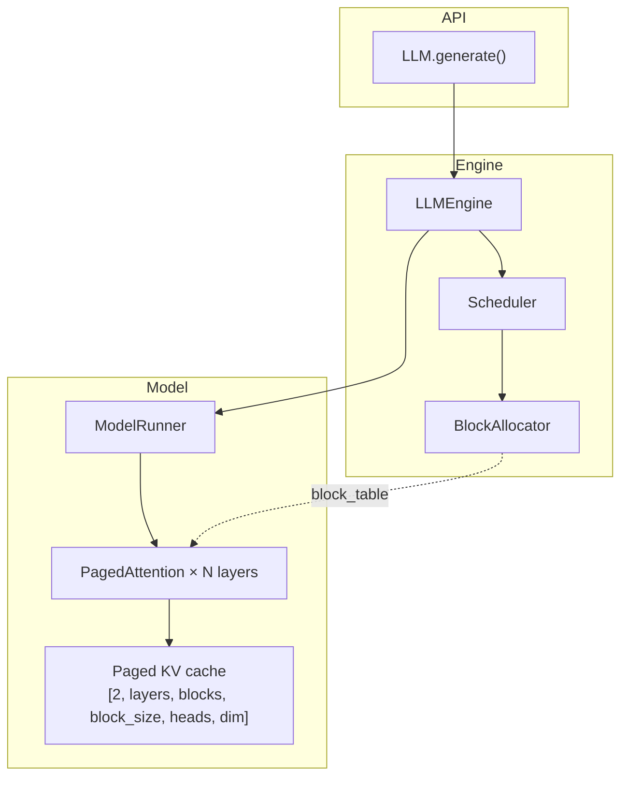

# mini-vllm

A from-scratch, single-GPU LLM inference engine inspired by [vLLM](https://github.com/vllm-project/vllm) and [nano-vllm](https://github.com/GeeeekExplorer/nano-vllm). It implements the core ideas behind high-throughput serving — **paged KV cache**, **continuous batching**, and a **step-based engine loop** — in ~500 lines of readable Python.

Default model: [`meta-llama/Llama-3.2-1B`](https://huggingface.co/meta-llama/Llama-3.2-1B)

---

## What this project does

mini-vllm is an educational but functional inference stack. You send one or more text prompts, and the engine:

1. Tokenizes each prompt into a `Sequence`
2. Schedules running requests with a block-aware scheduler
3. Runs **prefill** (process the full prompt) then **decode** (one token at a time) through a Llama model
4. Stores KV activations in a **paged GPU cache** instead of one giant tensor per sequence
5. Returns generated text when a sequence hits EOS or `max_tokens`

This is the same shape as production inference systems — just stripped down to one GPU, synchronous execution, and greedy sampling.

---

## What's implemented

| Component | Status | Description |
|-----------|--------|-------------|
| **PagedAttention** | Done | Custom attention layer with block-indexed K/V cache, RoPE, GQA, causal masking |
| **Block allocator** | Done | Fixed-size block pool with ref-counted `PhysicalBlock`s |
| **Scheduler** | Done | FCFS queue, continuous batching up to `max_batch_size` |
| **Engine loop** | Done | `add_request` → `schedule` → prefill/decode → sample → free blocks |
| **Model runner** | Done | Loads Llama via HuggingFace, patches attention layers at init |
| **LLM API** | Done | Simple `LLM.generate(prompts, SamplingParams)` facade |
| **Benchmarks** | Done | TTFT, prefill/decode tok/s, batch throughput |
| **Vast.ai script** | Done | One-command setup + demo + benchmark on a rented GPU |

### Not yet implemented

- Temperature / top-p / top-k sampling (currently greedy `argmax`)
- HTTP server or streaming
- Multi-GPU / tensor parallelism
- Prefix caching, CUDA graphs, chunked prefill
- Non-Llama architectures

---

## Architecture



### Request lifecycle

```
WAITING  →  (scheduler allocates blocks)  →  RUNNING
RUNNING  →  prefill step (prompt tokens)   →  first output token
RUNNING  →  decode steps (1 token/step)    →  FINISHED
FINISHED →  blocks returned to free pool
```

Each sequence carries a **block table** — a list of `PhysicalBlock` objects pointing into the shared KV cache. When a sequence grows past a block boundary, the scheduler allocates another block from the pool.

---

## Project layout

```
minivllm/
  config.py              # model path, block pool size, batch limits
  llm.py                 # LLM facade
  sampling_params.py     # max_tokens, temperature (unused for now)
  engine/
    llm_engine.py        # generation loop (add_request, step, generate)
    scheduler.py         # waiting/running queues, block allocation
    block_manager.py     # PhysicalBlock + BlockAllocator
    model_runner.py      # HF model load, attention patching, prefill/decode
    sequence.py          # Sequence state machine
  layers/
    attention.py         # PagedAttention module
bench.py                 # CUDA benchmark script
run.sh                   # Vast.ai one-shot setup + run
```

---

## Quick start

### Prerequisites

- Python 3.11+
- CUDA GPU
- [uv](https://docs.astral.sh/uv/) package manager
- Hugging Face account with [Llama 3.2 license accepted](https://huggingface.co/meta-llama/Llama-3.2-1B)

### Local

```bash
uv sync
export HF_TOKEN=hf_your_token_here   # or: huggingface-cli login

uv run python -c "
from minivllm import LLM, SamplingParams
llm = LLM()
print(llm.generate('The capital of France is', SamplingParams(max_tokens=32)))
"
```

### Vast.ai

Rent a CUDA instance, clone this repo, then:

```bash
export HF_TOKEN=hf_your_token_here
chmod +x run.sh
./run.sh
```

`run.sh` installs dependencies, runs a two-prompt demo, then benchmarks.

---

## API

```python
from minivllm import LLM, Config, SamplingParams

# Default: meta-llama/Llama-3.2-1B, 256 blocks × 16 tokens, batch 8
llm = LLM()

# Custom config
llm = LLM(config=Config(
    model="meta-llama/Llama-3.2-1B-Instruct",
    num_blocks=512,
    block_size=16,
    max_batch_size=4,
))

results = llm.generate(
    ["The capital of France is", "Machine learning is"],
    SamplingParams(max_tokens=64),
)
# {0: " Paris...", 1: " the..."}
```

### Config defaults

| Parameter | Default | Meaning |
|-----------|---------|---------|
| `model` | `meta-llama/Llama-3.2-1B` | HuggingFace model id |
| `num_blocks` | 256 | KV blocks in the GPU pool |
| `block_size` | 16 | Tokens stored per block |
| `max_batch_size` | 8 | Max concurrent sequences |

---

## Benchmarking

```bash
uv run python bench.py --warmup --max-tokens 64 --batch-size 4
```

| Metric | What it measures |
|--------|------------------|
| **TTFT** | Time for the first engine step (prefill + first token) |
| **Prefill tok/s** | Prompt tokens ÷ TTFT |
| **Decode tok/s** | Generated tokens after the first ÷ sum of decode step times |
| **Batch throughput** | Total output tokens ÷ wall time for N concurrent prompts |

Flags: `--model`, `--num-blocks`, `--block-size`, `--max-batch-size`, `--max-tokens`, `--batch-size`, `--warmup`.

---

## How paged attention works here

Standard inference allocates a full `[max_seq_len × layers × heads × dim]` KV tensor per request. That wastes GPU memory when sequences are short or finish early.

mini-vllm instead:

1. Pre-allocates one shared KV tensor shaped `[2, layers, num_blocks, block_size, kv_heads, head_dim]`
2. Maps each sequence to a list of block ids via a **block table**
3. On each forward pass, `PagedAttention` writes new K/V into the correct block slot and reads all past K/V back through the table
4. When a sequence finishes, its blocks go back to the free pool for reuse

The attention layers are patched in at model load time — HuggingFace's stock `LlamaAttention` is replaced with `PagedAttention`, which reuses the original projection weights.

---

## References

- [PagedAttention paper](https://arxiv.org/abs/2309.06180) — block-based KV cache management
- [Inside vLLM](https://www.aleksagordic.com/blog/vllm) — anatomy of a high-throughput inference system
- [nano-vllm](https://github.com/GeeeekExplorer/nano-vllm) — minimal reference implementation
